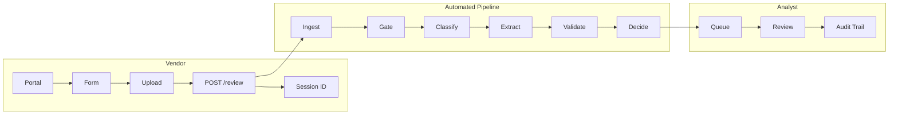

# Vendor Review Agent

FastAPI service for vendor document intake, AI-assisted document review, rules validation, routing, audit logging, and analyst decisioning.

## What This Project Does

- Accepts vendor intake details plus supporting documents from a simple vendor portal
- Assigns a vendor tier based on intake answers
- Runs a six-stage review pipeline:
  - ingest
  - completeness gate
  - classify
  - extract
  - validate
  - decide
- Persists each review session as:
  - an append-only audit log
  - a structured session summary
- Exposes an analyst dashboard with:
  - queue view
  - review workspace
  - audit trail

## Architecture Diagram

The current implementation diagram lives in [docs/architecture.md](/Users/roshankumar/Desktop/Certa_assignment/vendor-review-agent/docs/architecture.md).



## Repository Layout

```text
vendor-review-agent/
├── config/
│   └── rules.yaml
├── docs/
│   └── architecture.md
├── logs/
├── models/
│   └── schemas.py
├── pipeline/
│   ├── ingest.py
│   ├── gate.py
│   ├── classify.py
│   ├── extract.py
│   ├── validate.py
│   └── decide.py
├── sample_docs/
├── tests/
├── ui/
│   ├── vendor.html
│   └── analyst.html
├── utils/
│   ├── audit.py
│   └── external.py
├── main.py
├── README.md
├── render.yaml
└── requirements.txt
```

## Pipeline Summary

### 1. Ingest

- Accepts `PDF`, `DOCX`, `JPG`, `PNG`, and plain text/email-style uploads
- Computes a SHA-256 hash per file
- Uses OCR when needed for images and scanned PDFs
- Records `DOCUMENT_RECEIVED` or `DOCUMENT_REJECTED`

### 2. Completeness Gate

- Checks tier-specific required documents from [`config/rules.yaml`](/Users/roshankumar/Desktop/Certa_assignment/vendor-review-agent/config/rules.yaml)
- Blocks the session immediately if required docs are missing
- Records `COMPLETENESS_GATE`

### 3. Classify

- Uses `gpt-4o-mini` by default
- Produces a document type, confidence score, and reasoning
- Required docs with weak or unknown classification are later flagged during validation
- Records `CLASSIFICATION`

### 4. Extract

- Uses `gpt-4o` by default
- Extracts schema-specific fields per document type
- Stores per-field confidence
- Low-confidence required-doc extraction is escalated later in validation
- Records `FIELD_EXTRACTED`

### 5. Validate

- Applies field rules from [`config/rules.yaml`](/Users/roshankumar/Desktop/Certa_assignment/vendor-review-agent/config/rules.yaml)
- Applies cross-document checks
- Runs mocked OFAC and ABA checks
- Adds flags such as:
  - `CLASSIFICATION_UNKNOWN_001`
  - `CLASSIFICATION_LOW_CONFIDENCE_001`
  - `EXTRACTION_SPOT_CHECK_001`
- Records `FLAG_RAISED` and `EXTERNAL_CHECK_COMPLETED`

### 6. Decide

- Computes:
  - routing queue
  - SLA
  - session status
  - evidence pack markdown
- Records `ROUTING_ASSIGNED`

## Status and Routing

### Status values

- `BLOCKED`
- `REVIEW_REQUIRED`
- `REVIEW_RECOMMENDED`
- `CLEAR`

### Routing outcomes

- `LEGAL_AND_COMPLIANCE` for OFAC hits
- `SENIOR_ANALYST` for critical flags
- `STANDARD_ANALYST` otherwise

## Audit Trail

Each session writes an append-only JSONL audit log in `logs/`.

Key events:

- `REVIEW_SESSION_STARTED`
- `DOCUMENT_RECEIVED`
- `DOCUMENT_REJECTED`
- `COMPLETENESS_GATE`
- `CLASSIFICATION`
- `FIELD_EXTRACTED`
- `FLAG_RAISED`
- `EXTERNAL_CHECK_COMPLETED`
- `ROUTING_ASSIGNED`
- `ANALYST_DECISION`

`logs/{session_id}.summary.json` stores the latest structured session snapshot used by the analyst APIs and embeds the evidence pack markdown.

## Local Setup

1. Create and activate a virtual environment.
2. Install dependencies:

```bash
pip install -r requirements.txt
```

3. Add environment variables to `.env`:

```env
OPENAI_API_KEY=sk-...
OPENAI_MODEL_CLASSIFY=gpt-4o-mini
OPENAI_MODEL_EXTRACT=gpt-4o
PROMPT_VERSION_CLASSIFY=1.0
PROMPT_VERSION_EXTRACT=1.0
```

4. Optionally generate sample documents:

```bash
python sample_docs/generate_sample_docs.py
```

5. Run the app:

```bash
uvicorn main:app --reload
```

6. Open:

- `http://127.0.0.1:8000/vendor`
- `http://127.0.0.1:8000/analyst`

## Development Notes

- If no `OPENAI_API_KEY` is present, the app falls back to deterministic heuristics for classification and extraction so local testing still works.
- Image and scanned-PDF OCR requires the system `tesseract` binary.
- If `tesseract` is missing, ingestion records a structured error instead of crashing the request.
- The analyst dashboard includes queue, review, and audit-trail views in a single page.
