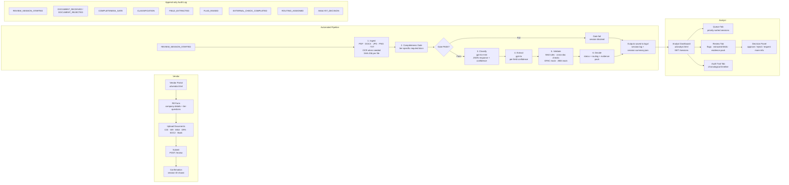

# Architecture

This project uses a small FastAPI service with a six-stage document review pipeline, append-only audit logging, and a static HTML analyst dashboard.

## End-to-End Flow

## Notes

- `session.summary.json` contains the structured session snapshot and embeds the evidence pack markdown. It is not written as a separate markdown file.
- Routing outcomes in code are:
  - `LEGAL_AND_COMPLIANCE` for OFAC hits
  - `SENIOR_ANALYST` for critical flags
  - `STANDARD_ANALYST` otherwise
- Status outcomes in code are:
  - `BLOCKED`
  - `REVIEW_REQUIRED`
  - `REVIEW_RECOMMENDED`
  - `CLEAR`
